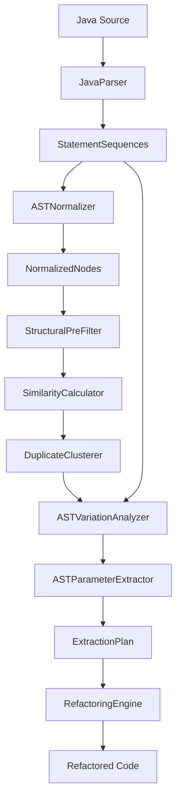

# AGENTS.md
Guidance for AI Coding Agents working on **Bertie**.

## Project Overview
Bertie is an intelligent duplicate code detector and refactoring tool for Java (OpenJDK 21). It uses multi-algorithm similarity analysis (LCS, Levenshtein, Structural) and AST-based refactoring strategies.

## ⚡ Development Workflow (The Golden Cycle)
Follow this cycle for *every* code change:

1.  **Reset**: `git reset --hard` in `test-bed`.
2.  **Compile**: `mvn clean compile` in `bertie`.
3.  **Run**: `./run-bertie.sh refactor --mode batch --config-file src/main/resources/bertie.yml`
4.  **Verify**:
    -   Check `git diff` in `test-bed`.
    -   Run `mvn test-compile` in `test-bed` (Verification Step 1).
5.  **Test**:
    -   `git checkout src/test/java` (Reset test files).
    -   `mvn test` in `test-bed` (Verification Step 2).
    -   **Rule**: If any tests fail, REVERT and RETRY.

## ⚠️ Critical Safety Rules
1.  **Nested Returns**: Strictly forbidden. If a duplicate block contains `return` nested in `if/while`, it must be skipped (`MANUAL_REVIEW_REQUIRED`) to prevent logic breakage.
2.  **Truncation**: Safety checks must evaluate the *truncated* sequence (as found in duplicate detection), not the potential full match.
3.  **Fail Fast**: If type resolution fails, abort the refactoring for that cluster.

## Architecture


### Key Components
-   **Dual AST**: `NormalizedNode` (Fuzzy/Anonymized) for detection, `StatementSequence` (Original) for refactoring.
-   **Type Resolution**: Relies on Antikythera's `Resolver` and `TypeWrapper`.
-   **Safety**: All refactorings follow: `Validate -> Backup -> Extract -> Apply -> Verify`.

## 🛠️ Antikythera Power Tools
Leverage these core library utilities to avoid reinventing the wheel:

### `AntikytheraRunTime` (Global Cache)
Acts as the central runtime state manager. Use `getCompilationUnit(String fqn)` to access cached ASTs instantaneously without re-parsing files.
It also maintains global type caches, ensuring consistent state across the entire analysis pipeline.

### `AbstractCompiler` (Parser & Resolver)
The heavyweight wrapper around JavaParser. It provides robust type resolution methods like `findType()` and `findFullyQualifiedName()`,
handling complex imports, wildcards, and inheritance hierarchies that standard JavaParser calls might miss. Best of all, 
it integrates seamlessly with Antikythera's `Resolver` for deep type analysis. 

### `Settings` (Configuration)
Simplifies YAML configuration management. It automatically loads `bertie.yml` (and other configs) at startup. 
Use `Settings.getProperty("key")` to access any configuration value without writing custom file I/O logic.

### `DepSolver` (Dependency Engine)
A powerful graph-based dependency extractor. It can build a complete dependency graph for a method or class using Depth-First Search (DFS), allowing you to identify every method, field, and type required to extract a standalone component.

## Common Commands
```bash
# Analyze Only
./run-bertie.sh analyze

# Refactor
./run-bertie.sh refactor --mode batch --config-file src/main/resources/bertie.yml

# Build Tool
mvn clean compile
```

## Key Files
-   `BertieCLI.java`: Main Entry Point.
-   `RefactoringRecommendationGenerator.java`: Decision logic for strategies.
-   `DataFlowAnalyzer.java`: Variable scope analysis.
