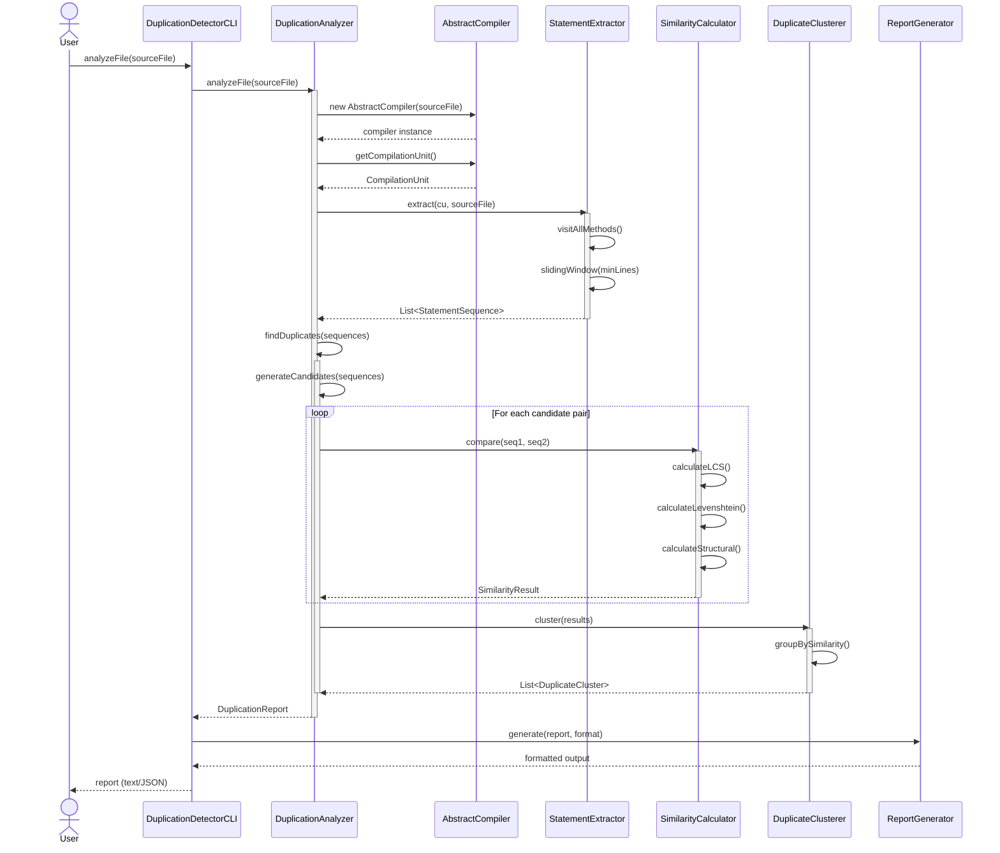
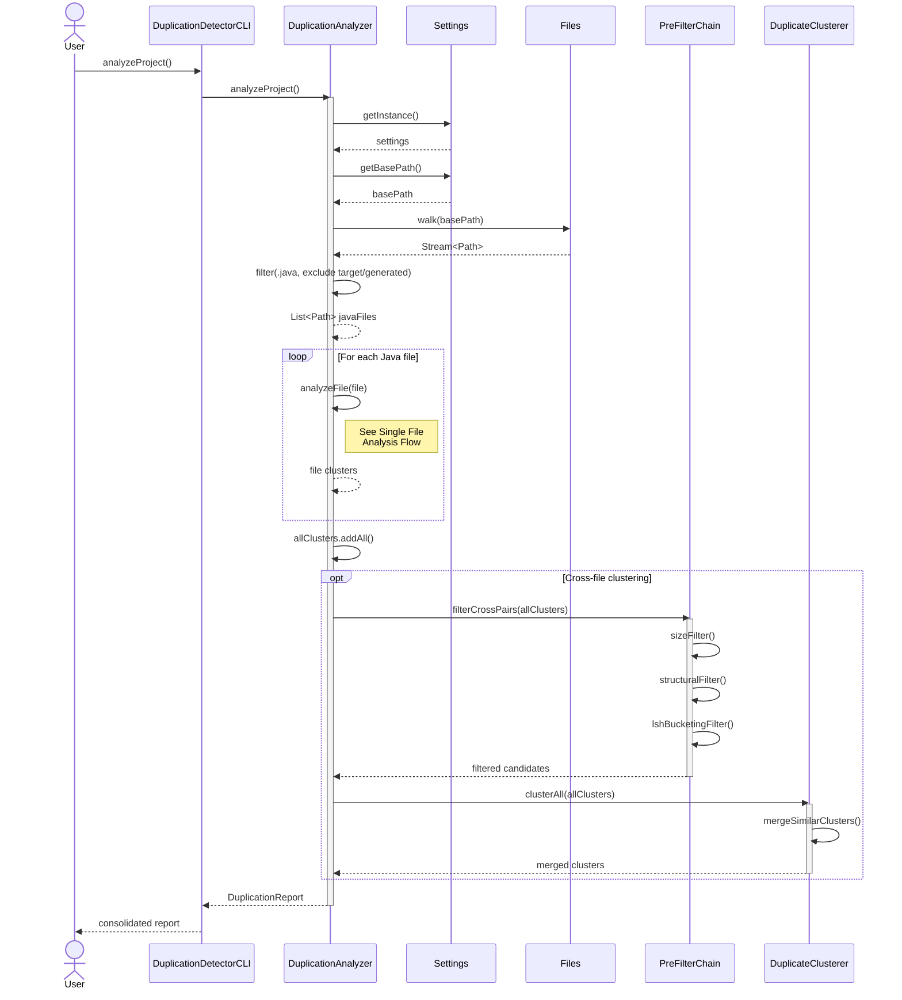
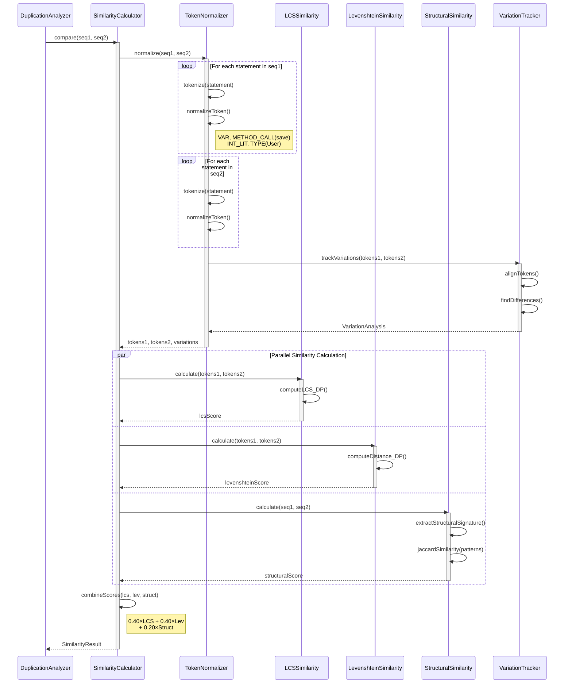
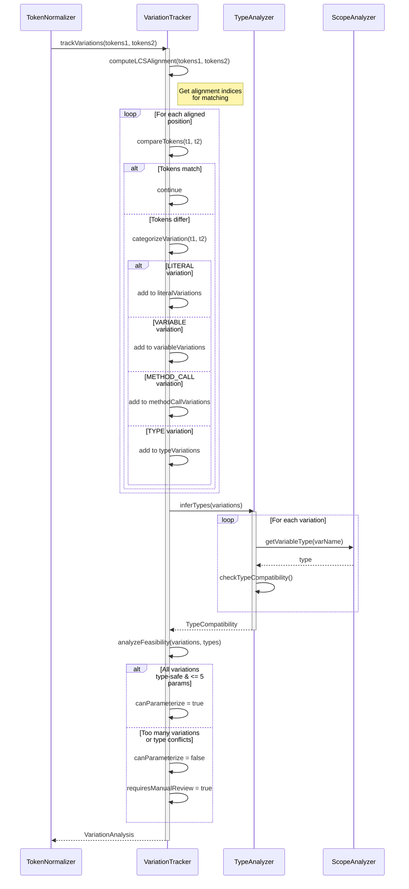
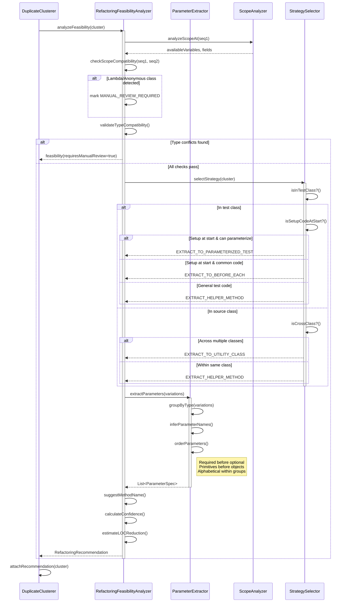
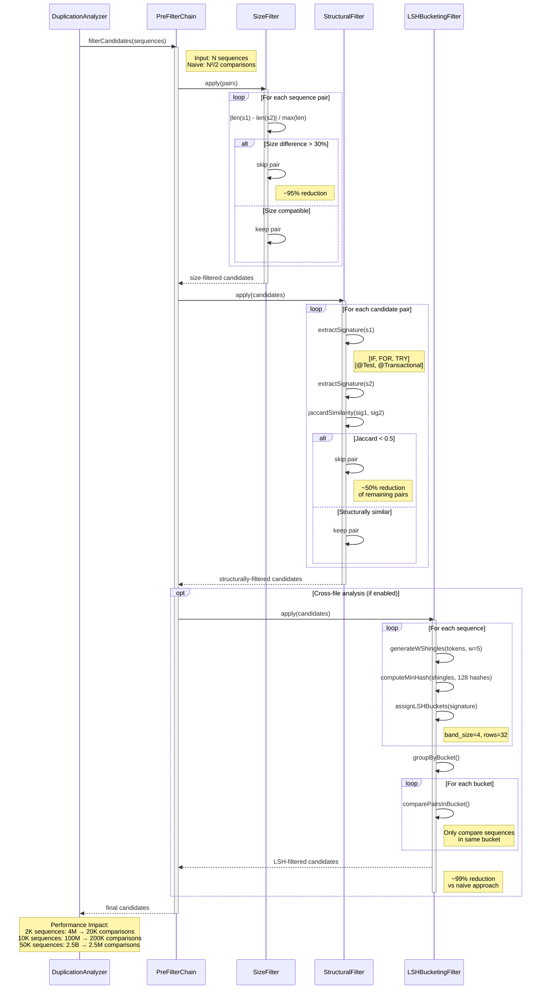

# Duplication Detector - Sequence Diagrams

**Version**: 1.0  
**Date**: December 9, 2025  
**Purpose**: Visual representation of essential flows in the duplication detection system

---

## Table of Contents

1. [Single File Analysis Flow](#1-single-file-analysis-flow)
2. [Project-Wide Analysis Flow](#2-project-wide-analysis-flow)
3. [Similarity Calculation Flow](#3-similarity-calculation-flow)
4. [Variation Tracking Flow](#4-variation-tracking-flow)
5. [Refactoring Recommendation Flow](#5-refactoring-recommendation-flow)
6. [Pre-Filtering Flow](#6-pre-filtering-flow)

---

## 1. Single File Analysis Flow

This diagram shows how a single Java file is analyzed for duplicate code blocks.

**Key Points**:
- Leverages `AbstractCompiler` for parsing (no reinvention)
- Sliding window extracts all possible sequences
- Parallel similarity calculation for performance
- Clustering groups related duplicates

---

## 2. Project-Wide Analysis Flow

This diagram shows cross-file duplicate detection across an entire project.

**Key Points**:
- Uses `Settings` for project configuration
- Filters generated code automatically
- Pre-filtering reduces O(N²) comparisons dramatically
- Cross-file clustering identifies duplicates across modules

---

## 3. Similarity Calculation Flow

This diagram details how two statement sequences are compared for similarity.

**Key Points**:
- Normalization preserves method names (critical for semantic correctness)
- Variation tracking aligns tokens using LCS indices
- Three algorithms run in parallel for efficiency
- Weighted combination balances different similarity aspects

---

## 4. Variation Tracking Flow

This diagram shows how differences between similar code blocks are identified and categorized.

**Key Points**:
- Uses LCS alignment to correctly map variations
- Categorizes variations by type (literal, variable, method call, type)
- Type inference validates parameter extraction safety
- Limits to 5 parameters for maintainability

---

## 5. Refactoring Recommendation Flow

This diagram shows how refactoring suggestions are generated based on detected duplicates.

**Key Points**:
- Strategy selection based on code location (test vs source)
- Test-specific strategies (@BeforeEach, @ParameterizedTest)
- Parameter ordering follows best practices
- Confidence score reflects automation safety

---

## 6. Pre-Filtering Flow

This diagram shows how the three-stage filtering reduces comparison overhead.

**Key Points**:
- Three-stage filtering is critical for scalability
- Stage 1 (size) is cheapest, eliminates most incompatible pairs
- Stage 2 (structural) uses fast O(n) signatures
- Stage 3 (LSH) optional for cross-file analysis
- Total reduction: 99%+ for large projects

---

## Summary

These sequence diagrams illustrate:

1. **Single File Analysis** - Core detection loop for one file
2. **Project-Wide Analysis** - Scaling to entire codebases
3. **Similarity Calculation** - Hybrid algorithm combining LCS, Levenshtein, and structural analysis
4. **Variation Tracking** - Precise difference identification for parameter extraction
5. **Refactoring Recommendation** - Intelligent strategy selection based on context
6. **Pre-Filtering** - Performance optimization reducing O(N²) overhead

All flows leverage existing Antikythera infrastructure (`AbstractCompiler`, `Settings`) and JavaParser's AST, avoiding unnecessary reinvention while focusing on the unique value: semantic duplicate detection with automated refactoring capabilities.
